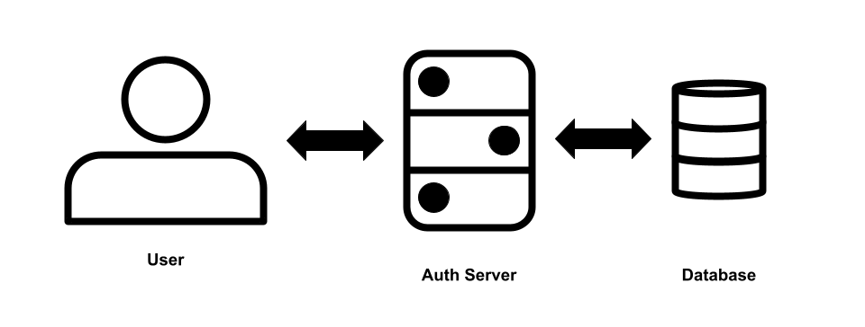
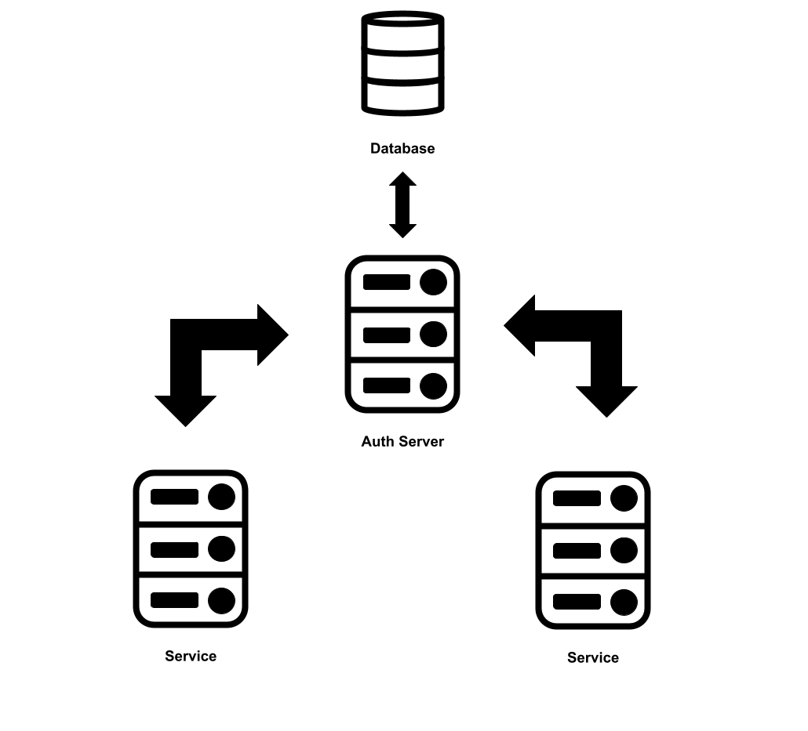

# Architecture
In this section, we will go over the architecture of Auth Server and explain how the different Lif Platforms services rely on it for identity and access management. The Auth Server is designed as a centralized, containerized service that acts as the single source of truth for authentication, authorization, and account management.

## Core Components
- **Auth API:** This is the core of Auth Server. Its what services interact with when they want to authenticate/authorize a user.

- **Database:** Auth Server uses MySQL for our database. It stores information such as usernames, passwords, tokens, profile info, permissions, and more.

## User Interactions
Users are able to directly interface with Auth Server to perform certain actions. These include logging in, changing passwords, updating profile info, etc. In fact, our account manager [My Lif](https://my.lifplatforms.com) doesn't have it's own backend. It interfaces directly with Auth Server for all of its actions.

## Service Interactions
Services can interface with Auth Server for multiple reasons. Mostly, they interface to authenticate and authorize users. Individual services do not have direct access to the database for Auth Server. Instead, services can request information from Auth Server though the API.

